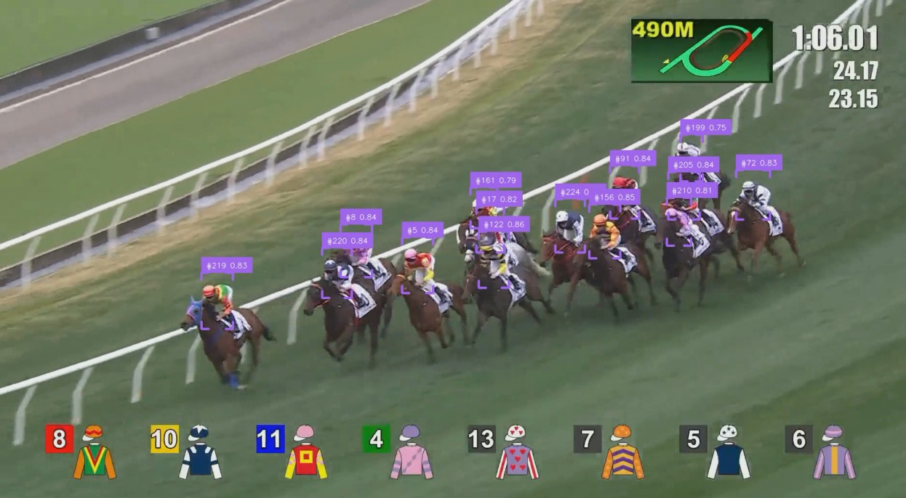

# Jockey Detection and Tracking for horse racing using YOLO v12
## Overview
This project attempts to detect and track jockeys during horse racing. Object detection framework Yolo v12 is used to detect and track jockeys.

## Setup
Setup environment for running/ training detector
<pre>
$ uv sync --all-groups
</pre>

## Training
Download training data
<pre>
$ cd datasets
$ curl -L "https://app.roboflow.com/ds/vmUZYhZXDx?key=CkMIyTH1xT" > roboflow.zip
$ unzip roboflow.zip
$ rm roboflow.zip
</pre>
Train a detection model based on yolo12l.pt
<pre>$ uv run yolo detect train data=datasets/data.yaml model=yolo12l.pt epochs=120 imgsz=640 batch=6
$ ls runs/detect/train/weights/
</pre>

## Inference
Download video for detect jockeys
<pre>
$ curl -o racing_20250131R8.mp4 https://streaminghkjc-a.akamaihd.net/hdflash/replay-full/2025/20250131/08/eng/replay-full_20250131_08_eng_1200kbps.mp4
</pre>
Download pretrained model for <a href='https://drive.google.com/file/d/1ep0ty__vMF7RO5xwBMFQgCWL09C-8jOp/view?usp=drive_link'>jockey detector</a>
<pre>
$ tar -zxvf detector_weights.tar.gz
</pre>
Detect and track jockeys
<pre>$ un run python predict.py --source_weights_path runs/detect/train/weights/best.pt --source_video_path racing_20250131R8.mp4 --target_video_path output.mp4 </pre>

